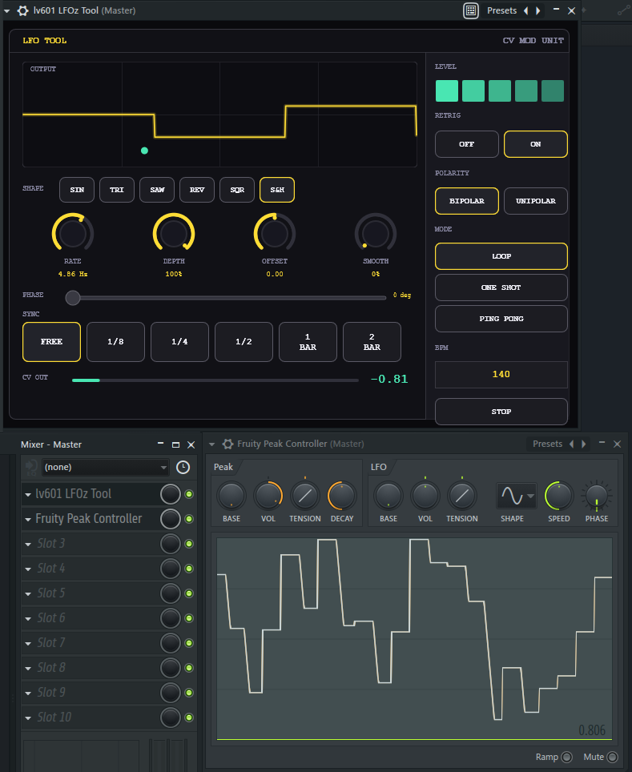

# LFOz Tool — VST3 for FL Studio / Windows 11



A JUCE-based VST3 modulation LFO inspired by Ableton Max for Live CV Tools.  
The included UI follows the supplied `lfotool.png` reference: dark CV-mod style panel, yellow waveform display, shape buttons, rotary controls, sync row, CV output meter and right-side mode/polarity/retrig controls.

## What this plugin does

- Generates an LFO signal as audio/CV on the plugin output.
- Passes incoming audio through and adds the LFO signal to it.
- Exposes automatable VST3 parameters:
  - Rate
  - Depth
  - Offset
  - Smooth
  - Phase
  - Waveform
  - Polarity
  - Sync division
  - Retrig
  - Mode
  - Run/Stop
- Tempo-sync options:
  - Free
  - 1/8
  - 1/4
  - 1/2
  - 1 Bar
  - 2 Bar
- Waveforms:
  - Sine
  - Triangle
  - Saw
  - Reverse Saw
  - Square
  - Sample & Hold
- Modes:
  - Loop
  - One Shot
  - Ping Pong

## Important note for FL Studio

VST3 plugins cannot directly "grab" and modulate arbitrary FL Studio controls the way FL-native controllers can. This plugin therefore outputs the LFO as an audio/CV-style signal. In FL Studio you can route/use that signal with tools such as Fruity Peak Controller, Patcher, sidechain/control routing, or further processing.

The plugin parameters themselves are automatable from FL Studio.

## Build on Windows 11

### Requirements

Install:

1. Visual Studio 2022
   - Include workload: **Desktop development with C++**
2. CMake 3.22 or newer
3. Git

### Build

Open **x64 Native Tools Command Prompt for VS 2022** or PowerShell in this folder and run:

```bat
build_windows.bat
```

Manual equivalent:

```bat
cmake -S . -B build -G "Visual Studio 17 2022" -A x64
cmake --build build --config Release --target LFOTool_VST3
```

The VST3 will usually be created at:

```text
build\LFOTool_artefacts\Release\VST3\LFO Tool.vst3
```

Copy it to:

```text
C:\Program Files\Common Files\VST3\
```

Then open FL Studio 2025 and run a plugin scan.

## GitHub Actions build

A Windows GitHub Actions workflow is included at:

```text
.github/workflows/windows-vst3.yml
```

Push this project to GitHub and run **Build Windows VST3** from the Actions tab. The built `.vst3` bundle will be uploaded as an artifact.

## Files

```text
CMakeLists.txt
build_windows.bat
Source/PluginProcessor.h
Source/PluginProcessor.cpp
Source/PluginEditor.h
Source/PluginEditor.cpp
ui-reference-lfotool.png
.github/workflows/windows-vst3.yml
```

Vibed by lv601
